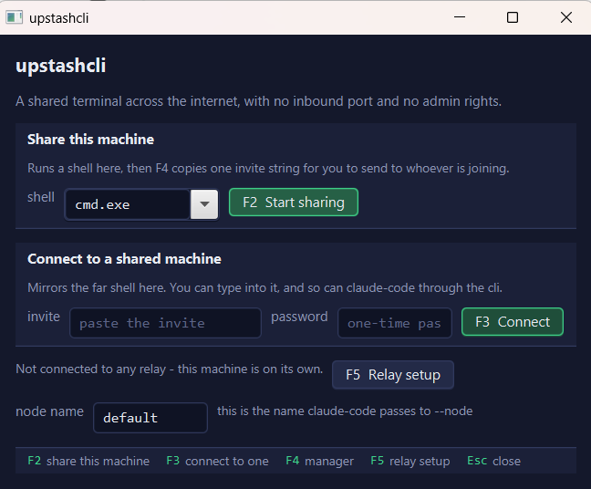
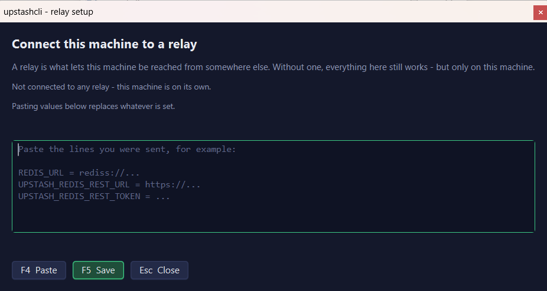
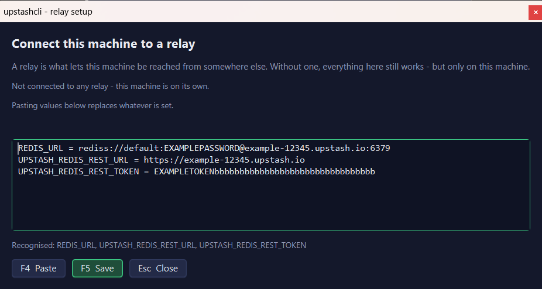

# Walkthrough — in progress

A step-by-step guide for the person being asked to share their machine. Every screenshot here is the real application, driven and captured rather than mocked, so what you see is what you will get.

**This is unfinished.** Three steps of the sequence are captured; the rest — sharing, sending the invite, approving whoever joins, and the controls available while they are connected — are still to be taken. `README.txt` inside the download already covers all of it in words.

---

## 1. What you see when you start it

`upstashcliapp.exe` opens this. Two things to do from here: share this machine, or connect to one somebody else is sharing.

The line above **node name** is the one worth reading first. Here it says *"Not connected to any relay - this machine is on its own."* That is what a fresh copy always says, and it is not a fault. Everything works on this machine in that state; nothing is announced anywhere, and nobody can reach it. Step 2 is how that changes.

Every action is a function key with no modifier, and every button wears its own key. There is nothing to remember and nothing that needs two hands.

## 2. Connecting it to a relay

Press **F5**. A relay is the meeting point both ends dial out to, which is what lets two machines find each other without either opening a port or having a fixed address.

Whoever invited you sends three lines. Paste them into the box — **F4** pastes from the clipboard if you would rather not use the mouse.

## 3. It tells you what it understood, before you save

As you paste, the line under the box reports what it found: *"Recognised: REDIS_URL, UPSTASH_REDIS_REST_URL, UPSTASH_REDIS_REST_TOKEN"*. That is deliberate — being told after saving that nothing was recognised is the point at which people give up on a setup screen.

It does not mind what shape the paste is in. Lines copied from a console, a whole settings file, quotes or no quotes, `=` or `:` — anything with the names on the left is understood, and anything else in the paste is ignored rather than refused.

Press **F5** to save. That is the whole setup and it is remembered. The values above are fictional; yours come from whoever invited you.

---

## Still to capture

The host window while sharing · the invite copied, with its confirmation · the activity log at **F12** · the lock and view-only states · the session details dialog · and the two-ended sequence: an invite pasted and split apart in the launcher, the approval prompt appearing on the machine being shared, and the viewer connected.
